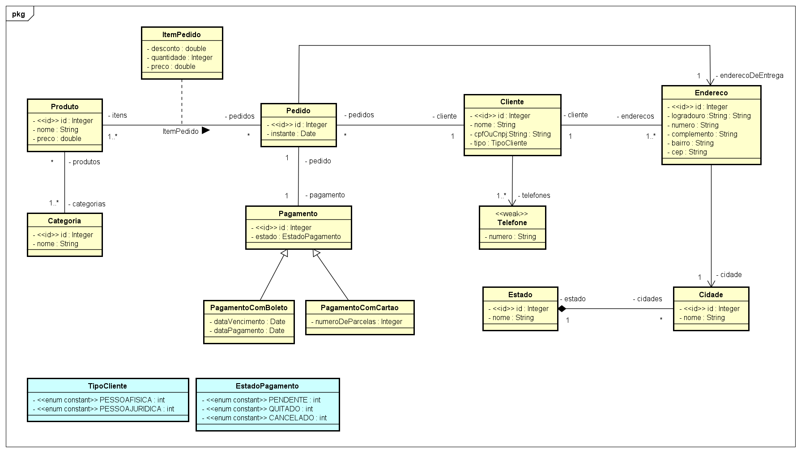

# Estudo de caso
## [Prof. Dr. Nelio Alves](https://www.udemy.com/user/nelio-alves)

## Implementação Java com Spring Boot e JPA

## Objetivo geral

Este estudo de caso tem como objetivo mostrar na prática como um modelo conceitual pode ser implementado
sobre o paradigma orientado a objetos, usando padrões de mercado e boas práticas.

Vamos tomar como caso um modelo conceitual abrangente, com o qual possamos mostrar a implementação prática
em linguagem orientada a objetos dos tópicos aprendidos no curso, quais sejam:

- Leitura e entendimento do diagrama de classes
- Leitura e entendimento do diagrama de objetos
- Associações
- Um para muitos / muitos para um
- Um para um
- Muitos para muitos
- Conceito dependente
- Classe de associação
- Herança
- Enumerações
- Tipos primitivos (ItemPedidoPK)
- Entidades fracas (ElementCollection)
- Associações direcionadas

## Objetivos específicos:

1) Fazer uma implementação padrão do seguinte modelo conceitual:

2) Gerar uma base de dados relacional automaticamente a partir do modelo conceitual, bem como povoar a base com a instância dada.

3) Recuperar os dados e disponibilizá-los por meio de uma API Rest BÁSICA. Os seguintes end points devem ser disponibilizados:

| End point | Dados |
| :---      | :---  |
|  `/categorias/{id}`  |  Categoria e seus produtos|
| `/clientes/{id}` | Cliente, seus telefones e seus endereços
| `/pedidos/{id}` | Pedido, seu cliente, seu pagamento, seus itens de pedido, seu endereço de entrega 

---
Made with :purple_heart: by Geovani Cavalcante :wave: [Get in touch!](https://www.linkedin.com/in/geovani-cv/)