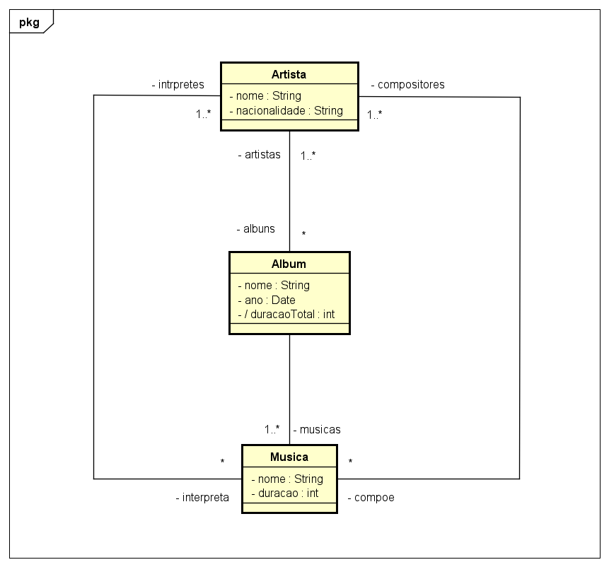
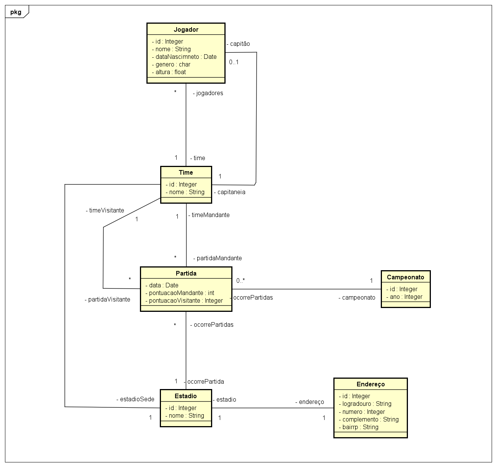
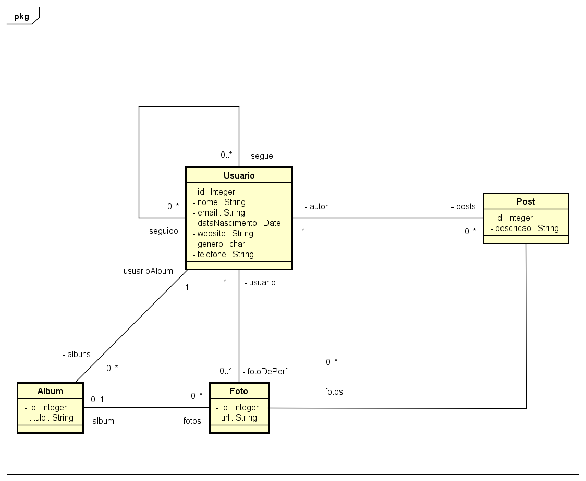
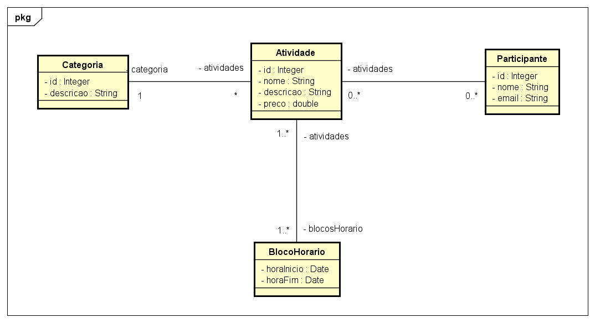
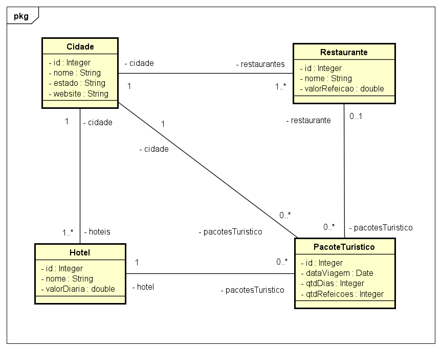

# Modelagem Conceitual com Diagrama de Classes da UML

## Exercícios e Respostas

## Capítulo: Associações e multiplicidade de papéis

### Exercício 1)
Deseja-se construir um sistema para manter um registro de artistas
musicais e seus álbuns. Cada álbum possui várias músicas, as quais poderão ser consultadas pelo
sistema. O sistema também deve permitir a busca de artistas por nome ou nacionalidade. O sistema
também deve ser capaz de exibir um relatório dos álbuns de um artista, o qual pode ser ordenado por
nome, ano, ou duração total do álbum. Um álbum pode ter a participação de vários artistas, sem
distinção. Já a música pode possuir um ou mais autores e intérpretes (todos considerados artistas).

### Resposta:

### Exercício 2)
Deseja-se construir um sistema para gerenciar as informações de
campeonatos de handebol, que ocorrem todo ano. Deseja-se saber nome, data de nascimento, gênero e
altura dos jogadores de cada time, bem como qual deles é o capitão de cada time. Cada partida do
campeonato ocorre em um estádio, que possui nome e endereço. Cada time possui seu estádio-sede e,
assim, cada partida possui um time mandante (anfitrião) e o time visitante. O sistema deve ser capaz
de listar as partidas já ocorridas e não ocorridas de um campeonato. O sistema deve também ser capaz
de listar a tabela do campeonato, ordenando os times por classificação, que é calculada em primeiro
lugar por saldo de vitórias e em segundo lugar por saldo de gols.

### Resposta:

### Exercício 3)
Deseja-se fazer um sistema de rede social. Nesta rede social, os usuários podem seguir e
ser seguidos por outros usuários. O perfil do usuário deve permitir cadastrar nome, email, data de
nascimento, website, gênero, telefone e foto do perfil. Os usuários podem fazer postagens de texto em
sua própria "linha do tempo" (timeline) da rede social, sendo que podem anexar também fotos às
postagens. Uma foto é referenciada pela URI de seu local de armazenamento. As fotos podem ser
organizadas em álbuns, sendo que cada álbum possui um título.

### Resposta:

### Exercício 4)
Deseja-se construir um sistema para gerenciar as informações dos participantes das
atividades de um evento acadêmico. As atividades deste evento podem ser, por exemplo, palestras,
cursos, oficinas práticas, etc. Cada atividade que ocorre possui nome, descrição, preço, e pode ser
dividida em vários blocos de horários (por exemplo: um curso de HTML pode ocorrer em dois blocos,
sendo necessário armazenar o dia e os horários de início de fim do bloco daquele dia). Para cada
participante, deseja-se cadastrar seu nome e email.

### Resposta:

### Exercício 5)
Deseja-se fazer um sistema para manter dados de cidades (nome, estado, website), onde
cada cidade possui um ou mais restaurantes (nome, valor da refeição) e hotéis (nome, valor da diária).
Além disso, deseja-se registrar pacotes turísticos vendidos. Para registrar um pacote turístico, deve-se
escolher uma cidade, definir a data da viagem, o hotel de hospedagem e o número de dias de
permanência. Deve-se também definir se no pacote vai estar incluso ou não um restaurante e, se sim,
quantas refeições por dia serão consumidas.

### Resposta:

---
Made with :purple_heart: by Geovani Cavalcante :wave: [Get in touch!](https://www.linkedin.com/in/geovani-cv/)

